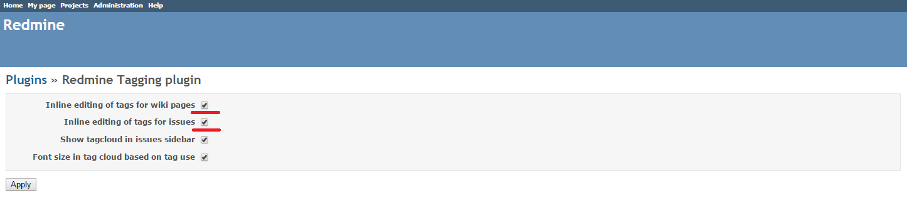
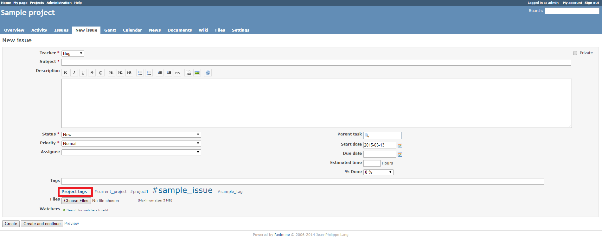
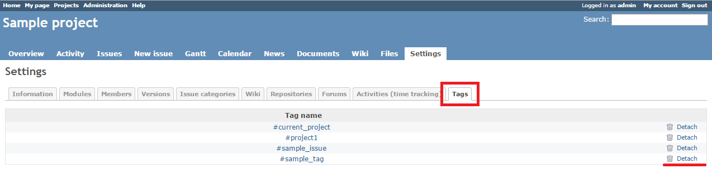
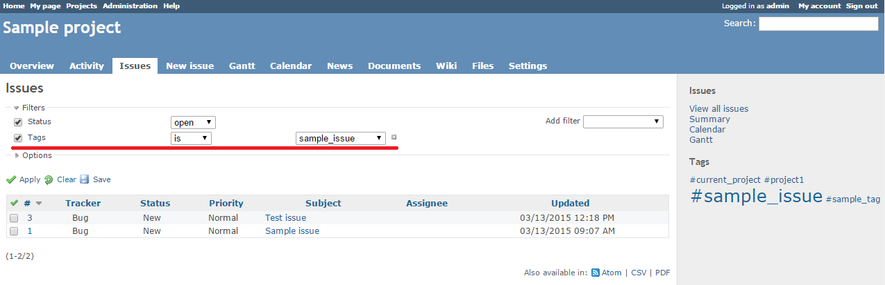

# Redmine Tagging Plugin

[](https://travis-ci.org/Restream/redmine_tagging)
[](https://codeclimate.com/github/Restream/redmine_tagging)

This plugin adds useful tagging features to Redmine:

* Tag cloud in the sidebar
* Tag suggestion and autocomplete
* Redmine search integration (possibility to search for #tag to find wikis/issues)
* Issue filters based on tags
* Batch assignment and detachment of tags
* Logging tag changes

The initial authors of the plugin are [Emiliano Heyns](mailto:emiliano.heyns@gmail.com) and [Vladimir Kiselev](https://github.com/nettsundere).

## Installation

*These installation instructions are based on Redmine 2.6.0. For instructions for previous versions, see [Redmine wiki](http://www.redmine.org/projects/redmine/wiki/Plugins).*

1. To install the plugin
    * Download the .ZIP archive, extract files and copy the plugin directory into #{REDMINE_ROOT}/plugins.
    
    Or

    * Change you current directory to your Redmine root directory:  

            cd {REDMINE_ROOT}
            
      Copy the plugin from GitHub using the following commands:
      
            git clone https://github.com/Restream/redmine_tagging.git plugins/redmine_tagging
            
2. Update the Gemfile.lock file by running the following commands:  

        bundle install
            
3. Run the migrations generator to create tables for tags and associations:

        bundle exec rake acts_as_taggable_on_engine:install:migrations RAILS_ENV=production
            
4. Run the following commands to upgrade your database (make a database backup before):  

        bundle exec rake db:migrate RAILS_ENV=production
        bundle exec rake redmine:plugins:migrate RAILS_ENV=production

5. Restart Redmine.

Now you should be able to see the plugin in **Administration > Plugins**.

### For MySql users
You can circumvent at any time the problem of special characters [issue 623](https://github.com/mbleigh/acts-as-taggable-on/issues/623) by setting in an initializer file:

```ruby
ActsAsTaggableOn.force_binary_collation = true
```

Or by running this rake task:

```shell
bundle exec rake acts_as_taggable_on_engine:tag_names:collate_bin
```

See the [configuration](https://github.com/mbleigh/acts-as-taggable-on#configuration) section in acts-as-taggable-on gem for more details.

## Usage

The plugin enables you to add tags to wiki and issue pages using either the **Tags** field or inline tags. To switch between these two modes, you should enable or disable the corresponding check boxes in the plugin settings. 

To switch to inline tag editing, go to **Administration > Plugins**, click **Configure**, select the corresponding check boxes and click **Apply**.  


After changing the settings, run the following command:

    bundle exec rake redmine:tagging:reconfigure RAILS_ENV=production

Failure to do so will result in loss of data (tags) when switching to another tagging mode.

Inline tags can be added using the following syntax:

    {{tag(tag_name)}}


Note that inline tags are saved when the object body is rendered. That's why if you want to remove all tags from an object, you must first add `{{tag}}` to its body to actually clear the tags. After that you can remove `{{tag}}` from the object body.

Adding `{{tagcloud}}` will generate a tag cloud, which will be displayed in the sidebar.  


The most often used tags are displayed in a larger font.

By default, inline tag editing is disabled. In this mode, you can type tags into the **Tags** field to add them to an issue or wiki page. You can use spaces or commas as tag separators.  


You can click the **Project tags** link below the **Tags** field to view all the project tags and select the required ones.  


The autocomplete feature will suggest the available tags as you start typing the tag name in the **Tags** field.  


All tags added to project issues are displayed on the **Tags** tab of the project settings. To detach a tag from an issue, click the **Detach** link.  


Tags can be used to search for issues and create issue filters:  
  


## Maintainers

Danil Tashkinov, [github.com/nodecarter](https://github.com/nodecarter)

## Thanks to

* https://github.com/jkraemer
